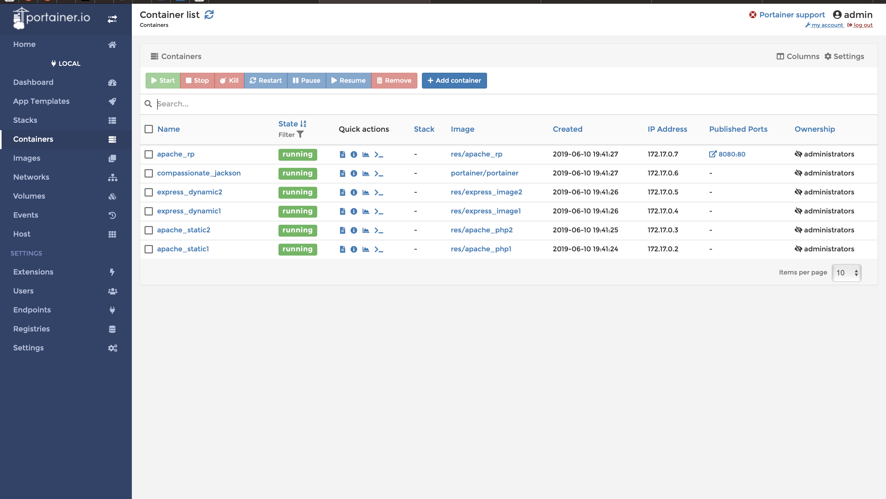

# Teaching-HEIGVD-RES-2018-Labo-HTTPInfra

## Step 1: Static HTTP server with apache httpd

Rien de spécial à dire pour cette partie du laboratoire, j'ai simplement suivi les webcasts et ça a marché du premier coup.

Pour le template, j'ai choisi d'utiliser ce template :
https://onepagelove.com/browny

Je l'ai un peu modifier pour qu'il contienne les différentes informations sur le laboratoire. Ainsi que rajouter un bouton nous renvoyons sur mon repo GitHub pour ce laboratoire.

## Step 2: Dynamic HTTP server with express.js

Pour ce laboratoire, comme précédemant, j'ai suivi les différents webcast afin d'arriver à ce résultat et il est fonctionnel.

Pour la partie qui génére des mots ou autres, je n'avais pas d'idée spécial, de ce fait j'ai installé une api qui renvoie un string aléatoire.

RandomStrings : https://www.npmjs.com/package/randomstring

Je lui indique la taille des strings et le type de string (seulement les caractères alphabétique dans mon cas).

J'utilise aussi l'api chance qui me permet de générer un nombre aléatoire pour savoir combien de string je vais créer.

## Step 3: Reverse proxy with apache (static configuration)

Rien de spécial pour la configuration de la partie, j'ai simplement suivi les webcasts.

pour cette partie, j'ai d'abord eu un problème de compréhension car lorsque je lançais les 3 containers, puis je me connectais au reverse proxy avec la commande docker run, je n'arrive pas à effectuer de telnet sur les deux autres containers. Je ne sais toujours pas pourquoi ça ne marche pas.

Mais heureusement, ça ne m'a pas entaché la suite de mon laboratoire.

Autre point plus ou moins important, je n'ai jamais utiliser VIM ou appris à l'utiliser donc je n'arrivais pas à éditer/sauvegarder mes fichiers. Donc j'ai décidé d'au lieu d'installer VIM sur mes containers, j'ai installé nano qui est un programme que j'ai plus l'habitude d'utiliser.

## Step 4: AJAX requests with JQuery

Niveau configuration, rien de spécial, j'ai tout simplement suivi les webcasts.

Cette partie est celle qui m'a pris le plus de temps. Car n'ayant jamais fait de web je ne savais pas comment trouver les classes etc...

Mon template HTML n'avait pas de classe comme présenté dans les webcasts ou il suffit de changer ça valeur et ça marchait. Du coup, j'ai pris pas mal de temps à regarder comment créer une classe pour l'inclure dans mon template pour ensuite pouvoir le faire bouger dynamiquement avec mon deuxième container.

## Step 5: Dynamic reverse proxy configuration

Rien de spécial à dire sur cette partie, j'ai simplement suivi les webcasts.

## Additional steps to get extra points on top of the "base" grade

### Load balancing: multiple server nodes

Pour cette partie, j'ai utilisé cette page de documentation fournie par apache : https://httpd.apache.org/docs/2.4/fr/mod/mod_proxy_balancer.html

Différentes étape faites pour réaliser cette parte :

1) Duplication de apache-php et express-image afin d'avoir deux nodes différentes.

2) Modification du fichier html index.html afin qu'il renvoie cluster 1 dans un image et cluster 2 dans l'autre, ceci sera affiché en gros sur le site pour savoir dans quel cluster on est.

3) Modification du script string.js pour qu'il renvoie cluster 1 ou 2 selon la session actuelle.

4) Modification du fichier de configuration php pour qu'il accepte les clusters. Un cookie est donné au client lorsqu'il se connect au serveur pour qu'il reste connecté tant qu'il est sur le site (effectué avec la variable set cookie et stickysession comme indiqué dans la documentation).

5) Ajout de librairie dans le Dockerfile de reverse-proxy : proxy_balancer lbmethod_byrequests headers

6) Création d'un script lançant plusieurs apache_static et express_dynamic plus lancement de apache_rp

### Load balancing: round-robin vs sticky sessions

Dans mon laboratoire, j'utilise une sticky sesssion qui va permettre que lorsque l'utilisateur se connècte au serveur, il garde toujours la même session jusqu'à ce qu'il parte.

J'ai aussi la variable lbmethod qui est initialisé à byrequests, ce qui permet de faire que le serveur gère les requête et les distribue selon le nombre de personnes connectées par session.

Ce nombre de personne est spécifié par la variable loadfactor, 1 dans notre cas.

### Management UI

Pour cette partie, j'ai décidé d'utiliser l'image portainer. Cette image est fourni en utilisant la commande docker **pull portainer/portainer**

Pour l'utiliser :

1) ajout de la commande lançant le container dans le script : **docker run -d -v /var/run/docker.sock:/var/run/docker.sock portainer/portainer**

2) changement du fichier config php pour le permettre d'accéder au portainer en utilisant **demo.res.ch/portainer/**:

3) création du compte admin :

4) Interface de portainer permettant de gérer tous les containers :

